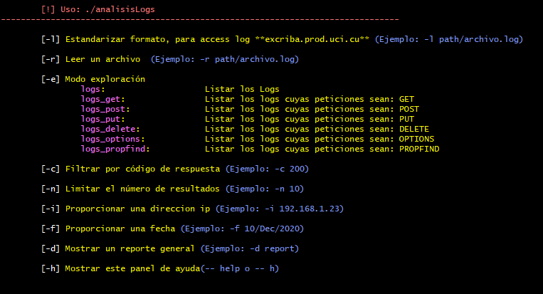

# analisisLogs


El script cuenta con varias opciones de filtrado de datos para facilitar la visualización de la información, permite el filtrado por una dirección IP, fecha de la solicitud, método utilizado en la solicitud y/o código de respuesta de estado de la petición. Además, permite generar un reporte sobre las direcciones IP, fechas más activas y recursos más solicitados, así como los horarios en que se realiza una mayor cantidad de solicitudes.
<p align="center">  </p>

Ejemplos de uso
```
./analisisLogs -l excriba.prod.uci.cu/excriba.prod.uci.cu_access_log.2023-11-24.log
./analisisLogs -r excriba.prod.uci.cu/excriba.prod.uci.cu_access_log.2023-11-24.log -e logs -i 127.0.0.1 -n 10
./analisisLogs -r excriba.prod.uci.cu/excriba.prod.uci.cu_access_log.2023-11-24.log -e logs -i 127.0.0.1 -f 24/Nov/2023 -n 10
./analisisLogs -r excriba.prod.uci.cu/excriba.prod.uci.cu_access_log.2023-11-24.log -e logs -i 127.0.0.1 -f 24/Nov/2023 -c 200 -n 10
./analisisLogs -r excriba.prod.uci.cu/excriba.prod.uci.cu_access_log.2023-11-24.log -e logs_get -i 127.0.0.1 -f 24/Nov/2023 -c 200 -n 10
./analisisLogs -r excriba.prod.uci.cu/excriba.prod.uci.cu_access_log.2023-11-24.log -e logs_post -i 127.0.0.1 -f 24/Nov/2023 -c 200 -n 10
./analisisLogs -r excriba.prod.uci.cu/excriba.prod.uci.cu_access_log.2023-11-24.log -e logs -d report
./analisisLogs -r excriba.prod.uci.cu/excriba.prod.uci.cu_access_log.2023-11-24.log -e logs -i 127.0.0.1 -f 24/Nov/2023 -d report
```
